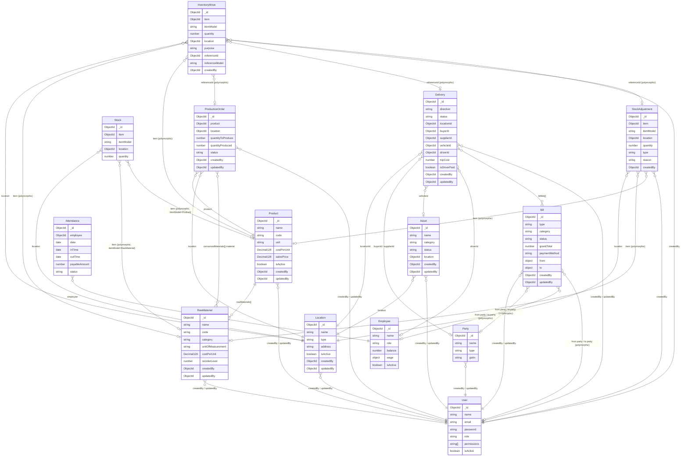

# Backend Technical Documentation
## Logistics & Manufacturing Management System

---

## Table of Contents
1. [Global Architecture & Data Flow](#1-global-architecture--data-flow)
2. [Database Schema Guide](#2-database-schema-guide)
3. [API Route Map & Function Documentation](#3-api-route-map--function-documentation)
4. [Frontend Integration Guidelines](#4-frontend-integration-guidelines)

---

## 1. Global Architecture & Data Flow

### Pattern
This backend follows a strict **3-Layer MVC architecture**:

```
Request → Route → Controller → Service → Model → MongoDB
                     ↓ (simple CRUD)
                   Model (directly, no service)
```

- **Routes** (`*_route.js`): Define HTTP endpoints, apply middleware, delegate to controllers.
- **Controllers** (`*_controller.js`): Handle HTTP request/response, validate inputs, call services.
- **Services** (`*_service.js`): Contain all business logic, transactions, and cross-model operations.
- **Models** (`*_model.js`): Mongoose schemas defining the MongoDB document structure.

> **Note on Middleware:** A `mockAuth` middleware is applied to mutation routes (POST/PATCH/DELETE). This is a placeholder for real JWT/session auth. It presumably populates `req.user._id` with a user ObjectId. Some routes (like `party`, `employee`, `attendance`) do NOT use `mockAuth` — these are TODO items flagged in the code comments.

---

### ER Diagram (Mermaid.js)



---

## 2. Database Schema Guide

### 2.1 `User`
**Collection:** `users`

| Field | Type | Required | Default | Notes |
|-------|------|----------|---------|-------|
| `name` | String | ✅ | — | trimmed |
| `email` | String | ✅ | — | unique, lowercase |
| `phone` | String | ❌ | — | E.164 format |
| `password` | String | ✅ | — | min 8 chars; `select: false` (never returned) |
| `role` | String (enum) | ❌ | `"staff"` | `admin`, `manager`, `staff` |
| `permissions` | String[] | ❌ | — | Custom permission strings |
| `isActive` | Boolean | ❌ | `true` | — |
| `lastLogin` | Date | ❌ | — | — |
| `createdBy` | ObjectId → User | ❌ | — | Self-referencing |
| `updatedBy` | ObjectId → User | ❌ | — | — |

**Relationships:** Referenced by almost every other model via `createdBy`/`updatedBy`. Also used as a polymorphic party reference in `Bill` (`from.party` / `to.party` when `model = 'User'`).

---

### 2.2 `Location`
**Collection:** `locations`

| Field | Type | Required | Default | Notes |
|-------|------|----------|---------|-------|
| `name` | String | ✅ | — | unique |
| `type` | String (enum) | ✅ | — | `factory`, `warehouse`, `office` |
| `address` | String | ✅ | — | — |
| `contact.manager` | String | ❌ | — | — |
| `contact.phone` | String | ❌ | — | E.164 format validated |
| `contact.email` | String | ❌ | — | — |
| `capacity.maxStockUnits` | Number | ❌ | — | min: 0 |
| `capacity.productionCapacity` | Number | ❌ | — | min: 0 |
| `isActive` | Boolean | ❌ | `true` | Set to `false` on soft-delete |
| `createdBy` | ObjectId → User | ✅ | — | — |
| `updatedBy` | ObjectId → User | ❌ | — | — |

**Relationships:** Referenced by `Asset.location`, `Delivery.locationId`, `ProductionOrder.location`, `Stock.location`, `StockAdjustment.location`, `InventoryMove.location`.

---

### 2.3 `Party`
**Collection:** `parties`

| Field | Type | Required | Default | Notes |
|-------|------|----------|---------|-------|
| `name` | String | ✅ | — | unique |
| `type` | String (enum) | ✅ | — | `buyer`, `supplier`, `both` |
| `address` | String | ❌ | — | — |
| `contact` | Array of `{person, phone, email}` | ❌ | — | Multiple contacts per party |
| `gstin` | String | ❌ | — | GST Identification Number |
| `bankingDetails` | `{bankName, accountNumber, ifscCode}` | ❌ | — | — |
| `createdBy` | ObjectId → User | ✅ | — | — |
| `updatedBy` | ObjectId → User | ❌ | — | — |

**Relationships:** Referenced by `Delivery.buyerId`, `Delivery.supplierId`, and polymorphically in `Bill.from.party` / `Bill.to.party` (when `model = 'Party'`).

---

### 2.4 `Employee`
**Collection:** `employees`

| Field | Type | Required | Default | Notes |
|-------|------|----------|---------|-------|
| `name` | String | ✅ | — | min 3 chars |
| `role` | String (enum) | ✅ | — | `worker`, `manager`, `driver`, `admin` |
| `wage.amount` | Number | ✅ | — | min: 0 |
| `wage.type` | String (enum) | ✅ | `"daily"` | `hourly`, `daily`, `monthly`, `per_trip` |
| `contact.phone` | String | ✅ | — | 10-digit regex validated |
| `contact.address` | String | ❌ | — | — |
| `joiningDate` | Date | ✅ | `Date.now` | — |
| `isActive` | Boolean | ❌ | `true` | — |
| `notes` | String | ❌ | — | — |
| `balance` | Number | ❌ | `0` | **Running tally of money owed to employee.** Incremented on clock-out/attendance update; decremented when payroll bill is paid. |

**Unique Index:** `{ name: 1, contact.phone: 1 }` — prevents duplicate name+phone combos.

**Relationships:** Referenced by `Attendance.employee`, `Delivery.driverId`. Also referenced polymorphically in `Bill.from.party` / `Bill.to.party` (when `model = 'Employee'`).

---

### 2.5 `RawMaterial`
**Collection:** `rawmaterials`

| Field | Type | Required | Default | Notes |
|-------|------|----------|---------|-------|
| `name` | String | ✅ | — | unique |
| `code` | String | ❌ | — | unique (sparse index) |
| `category` | String (enum) | ✅ | — | `parts`, `raw`, `recycled`, `packaging` |
| `unitOfMeasurement` | String (enum) | ✅ | — | `kg`, `g`, `litre`, `ml`, `unit`, `meter`, `cm` |
| `costPerUnit` | Decimal128 | ✅ | — | min: 0 |
| `reorderLevel` | Number | ❌ | `0` | Trigger threshold for reordering |
| `reorderQuantity` | Number | ❌ | `0` | How much to reorder when triggered |
| `createdBy` | ObjectId → User | ✅ | — | — |
| `updatedBy` | ObjectId → User | ❌ | — | — |

**Relationships:** Referenced by `Product.rawMaterials[].material`, `ProductionOrder.consumedMaterials[].material`, and polymorphically in `Stock`, `InventoryMove`, `StockAdjustment` (when `itemModel = 'RawMaterial'`).

> **Note:** `isActive` is referenced in controller code (reactivation logic) but NOT defined in the schema — this is a **bug/gap** in the current codebase.

---

### 2.6 `Product`
**Collection:** `products`

| Field | Type | Required | Default | Notes |
|-------|------|----------|---------|-------|
| `name` | String | ✅ | — | unique |
| `code` | String | ❌ | — | unique (sparse index) |
| `unit` | String (enum) | ✅ | — | `unit`, `kg`, `g`, `litre` |
| `costPerUnit` | Decimal128 | ✅ | — | min: 0 |
| `salesPrice` | Decimal128 | ✅ | — | min: 0 |
| `targetSalesPrice` | Decimal128 | ❌ | — | min: 0 |
| `rawMaterials` | Array of `{material: ObjectId→RawMaterial, quantity: Number}` | ❌ | — | The product recipe / Bill of Materials |
| `dailyProductionTarget` | Number | ❌ | — | min: 0 |
| `byProduct` | Array of `{name, producePerUnit, unit_measure}` | ❌ | — | Waste/secondary outputs |
| `isActive` | Boolean | ❌ | `true` | `select: false` — not returned by default |
| `createdBy` | ObjectId → User | ✅ | — | — |
| `updatedBy` | ObjectId → User | ❌ | — | — |

**Relationships:** Referenced by `ProductionOrder.product` and polymorphically in `Stock`, `InventoryMove`, `StockAdjustment` (when `itemModel = 'Product'`).

---

### 2.7 `Asset`
**Collection:** `assets`

| Field | Type | Required | Default | Notes |
|-------|------|----------|---------|-------|
| `name` | String | ✅ | — | trimmed |
| `category` | String (enum) | ✅ | — | `machinery`, `vehicle`, `it`, `furniture` |
| `location` | ObjectId → Location | ✅ | — | Where the asset is physically located |
| `status` | String (enum) | ❌ | `"active"` | `active`, `maintenance`, `retired`, `sold` |
| `purchaseDate` | Date | ❌ | — | — |
| `cost` | Number | ❌ | — | min: 0 |
| `notes` | String | ❌ | — | — |
| `serviceRecords` | Array of `{date, description, bills[]: ObjectId→Bill}` | ❌ | `[]` | Maintenance history log |
| `createdBy` | ObjectId → User | ✅ | — | — |
| `updatedBy` | ObjectId → User | ❌ | — | — |

**Index:** `{ location: 1, status: 1 }`

**Relationships:** `Asset.location` → `Location`. `Asset.serviceRecords[].bills[]` → `Bill`. Referenced by `Delivery.vehicleId`.

---

### 2.8 `Bill`
**Collection:** `bills`

| Field | Type | Required | Default | Notes |
|-------|------|----------|---------|-------|
| `type` | String (enum) | ✅ | — | `EXPENSE`, `INCOME` |
| `category` | String | ✅ | — | Free text (e.g., `"Payroll"`, `"Purchase"`) |
| `paymentMethod` | String (enum) | ❌ | `"CASH"` | `CASH`, `CREDIT_CARD`, `BANK_TRANSFER`, `CHEQUE`, `UPI`, `OTHER` |
| `paymentDate` | Date | ❌ | — | — |
| `items` | Array (see below) | ❌ | — | Line items |
| `items[].itemRef` | ObjectId (polymorphic) | ❌ | — | Optional link to `Product`, `RawMaterial`, or `Asset` |
| `items[].modelRef` | String (enum) | ❌ | — | `Product`, `RawMaterial`, `Asset` |
| `items[].name` | String | ✅ | — | — |
| `items[].quantity` | Number | ✅ | `1` | — |
| `items[].price` | Number | ✅ | — | — |
| `items[].total` | Number | ❌ | — | Auto-calculated via `pre('save')` hook |
| `grandTotal` | Number | ❌ | `0` | Auto-calculated via `pre('save')` hook |
| `from.name` | String | ❌ | — | Display name of sender |
| `from.party` | ObjectId (polymorphic) | ✅ | — | ref → `Party`, `Employee`, or `User` |
| `from.model` | String (enum) | ✅ | — | `Party`, `Employee`, `User` |
| `to.name` | String | ❌ | — | Display name of recipient |
| `to.party` | ObjectId (polymorphic) | ✅ | — | ref → `Party`, `Employee`, or `User` |
| `to.model` | String (enum) | ✅ | — | `Party`, `Employee`, `User` |
| `status` | String (enum) | ❌ | `"PENDING"` | `PENDING`, `PAID`, `OVERDUE` |
| `dueDate` | Date | ❌ | — | — |
| `notes` | String | ❌ | — | Appended with payment note on `markPaid` |
| `attachments` | Array of `{url, fileType, caption}` | ❌ | — | File attachments |
| `createdBy` | ObjectId → User | ✅ | — | — |
| `updatedBy` | ObjectId → User | ❌ | — | — |

> **Business Logic (Pre-save hook):** Before every save, `items[].total = quantity * price` and `grandTotal = sum(items[].total)` are recalculated automatically.

> **⚠️ Assumed Logic:** When `markBillAsPaid` is called and the bill is `EXPENSE` with `to.model === 'Employee'`, the service decrements `Employee.balance` by `grandTotal`. However, the `Payroll` flow via `processPayroll` creates the bill as already `PAID` with `status: 'PAID'`, which means this deduction logic in `markBillAsPaid` would NOT trigger (bill is already paid at creation). This is a **potential double-deduction bug** to review.

---

### 2.9 `Delivery`
**Collection:** `deliveries`

| Field | Type | Required | Default | Notes |
|-------|------|----------|---------|-------|
| `direction` | String (enum) | ✅ | — | `in` (incoming), `out` (outgoing) |
| `buyerId` | ObjectId → Party | ❌ | — | For `direction: 'out'` |
| `supplierId` | ObjectId → Party | ❌ | — | For `direction: 'in'` |
| `content` | Array (see below) | ✅ | — | Items in this delivery |
| `content[].itemType` | String (enum) | ✅ | — | `rawMaterial`, `product` |
| `content[].itemId` | ObjectId | ✅ | — | Polymorphic ref |
| `content[].quantity` | Number | ✅ | — | — |
| `content[].unit` | String | ✅ | — | — |
| `locationId` | ObjectId → Location | ✅ | — | The warehouse/factory receiving or dispatching |
| `billIds` | ObjectId[] → Bill | ❌ | — | Associated invoices |
| `vehicleId` | ObjectId → Asset | ❌ | — | Transport vehicle |
| `driverId` | ObjectId → Employee | ❌ | — | Driver assigned |
| `tripCost` | Number | ❌ | `0` | Driver payment for this trip |
| `isDriverPaid` | Boolean | ❌ | `false` | Flipped to `true` when driver balance is credited |
| `departureTime` | Date | ❌ | — | Set when status → `in-transit` |
| `arrivalTime` | Date | ❌ | — | Set when status → `delivered` |
| `status` | String (enum) | ❌ | `"pending"` | `pending`, `in-transit`, `delivered`, `cancelled` |
| `notes` | String | ❌ | — | — |
| `createdBy` | ObjectId → User | ❌ | — | — |
| `updatedBy` | ObjectId → User | ❌ | — | — |

> **⚠️ itemType inconsistency:** `content[].itemType` enum values are `"rawMaterial"` / `"product"` (lowercase), but `moveInventory` calls in the delivery service use `item.itemType` directly as the `itemModel` value, which the `InventoryMove` model expects as `"RawMaterial"` or `"Product"` (capitalized). This is a **case-mismatch bug** to fix.

---

### 2.10 `ProductionOrder`
**Collection:** `productionorders`

| Field | Type | Required | Default | Notes |
|-------|------|----------|---------|-------|
| `product` | ObjectId → Product | ✅ | — | What is being manufactured |
| `quantityToProduce` | Number | ✅ | — | Target output |
| `quantityProduced` | Number | ❌ | `0` | Actual output logged |
| `location` | ObjectId → Location | ✅ | — | Factory/warehouse where production happens |
| `status` | String (enum) | ✅ | `"pending"` | `pending`, `in_progress`, `completed`, `cancelled` |
| `notes` | String | ❌ | — | Variance report appended on completion |
| `consumedMaterials` | Array of `{material: ObjectId, quantity: Number, variance: Number}` | ❌ | `[]` | Tracks material usage |
| `createdBy` | ObjectId → User | ✅ | — | — |
| `updatedBy` | ObjectId → User | ❌ | — | — |

**Indexes:** `{ product: 1 }`, `{ location: 1 }`, `{ status: 1 }`

---

### 2.11 `Attendance`
**Collection:** `attendances`

| Field | Type | Required | Default | Notes |
|-------|------|----------|---------|-------|
| `employee` | ObjectId → Employee | ✅ | — | — |
| `date` | Date | ✅ | — | Normalized to midnight (00:00:00.000) |
| `inTime` | Date | ❌ | — | Actual clock-in timestamp |
| `outTime` | Date | ❌ | — | Actual clock-out timestamp |
| `payableAmount` | Number | ❌ | `0` | Wage earned for this day/shift |
| `status` | String (enum) | ✅ | — | `present`, `absent`, `leave`, `half-day` |

**Virtual:** `hoursWorked` = `(outTime - inTime) / 3,600,000`. Requires `toJSON: { virtuals: true }`.

**Unique Index:** `{ employee: 1, date: 1 }` — one record per employee per day.

---

### 2.12 `Stock`
**Collection:** `stocks`

| Field | Type | Required | Default | Notes |
|-------|------|----------|---------|-------|
| `item` | ObjectId (polymorphic) | ✅ | — | ref → `RawMaterial` or `Product` |
| `itemModel` | String (enum) | ✅ | — | `RawMaterial`, `Product` |
| `location` | ObjectId → Location | ✅ | — | — |
| `quantity` | Number | ✅ | `0` | min: 0 — **cannot go negative** |

**Unique Index:** `{ item: 1, location: 1 }` — one stock record per item per location.

> This is the **source of truth for current inventory**. `InventoryMove` is the audit log; `Stock` is the live counter.

---

### 2.13 `InventoryMove`
**Collection:** `inventorymoves`

| Field | Type | Required | Default | Notes |
|-------|------|----------|---------|-------|
| `item` | ObjectId (polymorphic) | ✅ | — | ref → `RawMaterial` or `Product` |
| `itemModel` | String (enum) | ✅ | — | `RawMaterial`, `Product` |
| `quantity` | Number | ✅ | — | **Negative for outflows, positive for inflows** |
| `location` | ObjectId → Location | ✅ | — | — |
| `purpose` | String (enum) | ✅ | — | `intake`, `production`, `transfer`, `sale`, `waste`, `correction` |
| `referenceId` | ObjectId (polymorphic) | ✅ | — | The document that triggered this move |
| `referenceModel` | String (enum) | ✅ | — | `ProductionOrder`, `Bill`, `Delivery`, `StockAdjustment` |
| `createdBy` | ObjectId → User | ✅ | — | — |

> Every inventory change must create an `InventoryMove` record AND update `Stock`. This is enforced through the `moveInventory()` service function.

---

### 2.14 `StockAdjustment`
**Collection:** `stockadjustments`

| Field | Type | Required | Default | Notes |
|-------|------|----------|---------|-------|
| `reason` | String | ✅ | — | min 10 chars |
| `type` | String (enum) | ✅ | — | `wastage`, `theft`, `count_error`, `expiry`, `damanged` *(typo in schema: should be "damaged")* |
| `item` | ObjectId (polymorphic) | ✅ | — | — |
| `itemModel` | String (enum) | ✅ | — | `RawMaterial`, `Product` |
| `location` | ObjectId → Location | ✅ | — | — |
| `quantity` | Number | ✅ | — | Can be negative (loss) or positive (found) |
| `createdBy` | ObjectId → User | ✅ | — | — |

---

## 3. API Route Map & Function Documentation

> **Base Path Assumption:** All routes are assumed to be mounted at `/api/v1/`. This is not in the provided code but is standard practice.
> **Auth:** Routes marked with 🔒 use `mockAuth` middleware (populates `req.user._id`). Routes without 🔒 are currently unprotected.

---

### 3.1 Users

#### `POST /api/v1/users`
- **Controller:** `createUser`
- **Auth:** None (⚠️ flagged in code as "fix this before production")
- **Purpose:** Creates a new system user (admin, manager, staff). Currently has NO auth protection and NO password hashing — a known pre-production gap.
- **Request Body:**
  ```json
  {
    "name": "Rajesh Kumar",
    "email": "rajesh@company.com",
    "phone": "+919876543210",
    "password": "secret123",
    "role": "manager"
  }
  ```
- **Response (201):**
  ```json
  { "success": true, "data": { "_id": "...", "name": "...", "email": "...", "role": "manager" } }
  ```
- **Response (400):** `{ "success": false, "error": "..." }`
- **DB Impact:** Writes to `users`

---

### 3.2 Locations

#### `GET /api/v1/locations`
- **Controller:** `getAllLocations`
- **Auth:** None
- **Purpose:** Retrieves all locations sorted A-Z by name. Used to populate location dropdowns in the UI.
- **Request:** No parameters
- **Response (200):** `{ "success": true, "data": [...locations] }`
- **DB Impact:** Reads `locations`

#### `GET /api/v1/locations/:id`
- **Controller:** `getLocationById`
- **Auth:** None
- **Purpose:** Fetches a single location's details.
- **Request:** Path param `id` (ObjectId)
- **Response (200):** `{ "success": true, "data": {...location} }`
- **Response (404):** `{ "success": false, "message": "Location not found" }`
- **DB Impact:** Reads `locations`

#### `POST /api/v1/locations` 🔒
- **Controller:** `createLocation`
- **Auth:** `mockAuth`
- **Purpose:** Creates a new physical location (factory, warehouse, or office). Input is sanitized in the service layer — only whitelisted fields are saved.
- **Request Body:**
  ```json
  {
    "name": "Main Factory",
    "type": "factory",
    "address": "Plot 5, Industrial Area, Pune",
    "contact": { "manager": "Suresh", "phone": "+912012345678", "email": "factory@co.com" },
    "capacity": { "maxStockUnits": 10000, "productionCapacity": 500 }
  }
  ```
- **Response (201):** `{ "success": true, "data": {...location} }`
- **Response (409):** `{ "success": false, "message": "Location name already exists." }`
- **DB Impact:** Writes to `locations`

#### `PATCH /api/v1/locations/:id` 🔒
- **Controller:** `updateLocation`
- **Auth:** `mockAuth`
- **Purpose:** Updates location details. Only whitelisted fields (`name`, `type`, `address`, `contact`, `capacity`) are updatable. `createdBy` and `isActive` cannot be changed via this route.
- **Request Body:** (any subset of location fields)
- **Response (200):** `{ "success": true, "data": {...updatedLocation} }`
- **DB Impact:** Reads and writes `locations`

#### `DELETE /api/v1/locations/:id?force=true|false` 🔒
- **Controller:** `deleteLocation`
- **Auth:** `mockAuth`
- **Purpose:** Soft-deletes a location by setting `isActive: false`. **Will be blocked** if any stock with `quantity > 0` exists at this location, unless `?force=true` is passed. With `force=true`, all stock quantities at this location are zeroed out first (with a console audit log), then the location is deactivated.
- **Request:** Path param `id`; Query param `force` (`true` | `false`, default `false`)
- **Response (200):** `{ "success": true, "message": "Location deactivated successfully", "data": { location: {...}, archivedStock: [...] } }`
- **Response (400) — blocked:** `{ "success": false, "message": "Cannot deactivate. Location has N active items.", "blockingItems": [{id, name, quantity}] }`
- **DB Impact:** Reads `stock`, writes `locations`, optionally writes `stock` (zeroing)

---

### 3.3 Parties

#### `GET /api/v1/parties`
- **Controller:** `getAllParties`
- **Auth:** None
- **Purpose:** Returns all parties (buyers, suppliers, or both). No filtering/pagination implemented.
- **Response (200):** Array of party objects (no `success` wrapper — inconsistent with other routes)
- **DB Impact:** Reads `parties`

#### `GET /api/v1/parties/:id`
- **Controller:** `getPartyById`
- **Auth:** None
- **Purpose:** Fetches a single party.
- **Response (200):** Party object (no `success` wrapper)
- **Response (404):** `{ "message": "Party not found" }`
- **DB Impact:** Reads `parties`

#### `POST /api/v1/parties`
- **Controller:** `createParty`
- **Auth:** None ⚠️ (no `mockAuth` applied)
- **Purpose:** Creates a new buyer/supplier. No input sanitization in controller — passes `req.body` directly to `new Party(req.body)`.
- **Request Body:**
  ```json
  {
    "name": "Sharma Suppliers Pvt Ltd",
    "type": "supplier",
    "address": "123 Market St, Delhi",
    "contact": [{ "person": "Amit Sharma", "phone": "9876543210", "email": "amit@sharma.com" }],
    "gstin": "07AABCS1429B1ZP"
  }
  ```
- **Response (201):** Party object
- **DB Impact:** Writes to `parties`

#### `PUT /api/v1/parties/:id`
- **Controller:** `updateParty`
- **Auth:** None ⚠️
- **Purpose:** Full-replace update for a party. Uses `PUT` (full replace), not `PATCH`.
- **DB Impact:** Reads and writes `parties`

#### `DELETE /api/v1/parties/:id`
- **Controller:** `deleteParty`
- **Auth:** None ⚠️
- **Purpose:** **Hard deletes** the party document. No soft-delete, no referential integrity check. ⚠️ This could orphan `Bill` and `Delivery` records.
- **Response (200):** `{ "message": "Party deleted successfully" }`
- **DB Impact:** Writes (deletes) `parties`

---

### 3.4 Employees

#### `GET /api/v1/employees?role=&isActive=&search=`
- **Controller:** `getEmployees`
- **Auth:** None
- **Purpose:** Lists all employees with optional filtering. `search` performs a case-insensitive regex match on `name` or `contact.phone`.
- **Query Params:** `role` (enum), `isActive` (boolean string), `search` (string)
- **Response (200):** `{ "success": true, "data": [...employees] }`
- **DB Impact:** Reads `employees`

#### `POST /api/v1/employees`
- **Controller:** `createEmployee`
- **Auth:** None ⚠️
- **Purpose:** Creates a new employee. Passes `req.body` directly to `Employee.create()` — no service layer sanitization.
- **Request Body:**
  ```json
  {
    "name": "Ramesh Yadav",
    "role": "worker",
    "wage": { "amount": 500, "type": "daily" },
    "contact": { "phone": "9876543210", "address": "Village Sundarpur" },
    "joiningDate": "2024-01-15"
  }
  ```
- **Response (201):** `{ "success": true, "data": {...employee} }`
- **Response (400):** `{ "success": false, "message": "Employee with this Name and Phone already exists." }` (on duplicate key)
- **DB Impact:** Writes to `employees`

#### `PATCH /api/v1/employees/:id`
- **Controller:** `updateEmployeeInfo`
- **Auth:** None ⚠️
- **Purpose:** Updates general employee info. Explicitly **strips `balance` and `wage`** from the update payload to prevent unauthorized financial changes via this route.
- **DB Impact:** Reads and writes `employees`

#### `GET /api/v1/employees/:id`
- **Controller:** `getEmployeeProfile`
- **Auth:** None
- **Purpose:** Returns the employee's full profile plus **current month attendance stats** — days present, total hours, and total earned this month. The `currentBalance` field shows the running balance (money owed to this employee).
- **Response (200):**
  ```json
  {
    "success": true,
    "data": {
      "_id": "...", "name": "Ramesh",
      "balance": 4500,
      "stats": {
        "currentBalance": 4500,
        "thisMonth": { "daysPresent": 9, "earnedThisMonth": 4500 }
      }
    }
  }
  ```
- **DB Impact:** Reads `employees`, aggregates `attendances`

#### `PATCH /api/v1/employees/:id/wage`
- **Controller:** `updateWage`
- **Auth:** None ⚠️ (should be admin-only per code comment)
- **Purpose:** Updates an employee's wage rate. Does NOT retroactively change past attendance payouts.
- **Request Body:** `{ "amount": 600, "type": "daily" }`
- **Response (200):** `{ "success": true, "data": {...updatedEmployee} }`
- **DB Impact:** Writes to `employees`

#### `POST /api/v1/employees/:id/payout` 🔒
- **Controller:** `payEmployee`
- **Auth:** `mockAuth` (requires `req.user._id`)
- **Purpose:** Processes a payroll payment. Creates a `Bill` (type `EXPENSE`, category `Payroll`, status `PAID`) from the logged-in admin user TO the employee. **Assumed logic:** The bill creation triggers the balance deduction via `markBillAsPaid` but since the bill is created as `PAID`, the deduction in `markBillAsPaid` applies. Review the double-deduction risk noted in §2.8.
- **Request Body:** `{ "amount": 4500, "paymentMethod": "CASH", "notes": "October wages" }`
- **Response (201):** `{ "success": true, "message": "Payment processed successfully", "data": {...bill} }`
- **DB Impact:** Reads `employees`, writes `bills`, writes `employees` (balance decrement)

#### `GET /api/v1/employees/:id/report`
- **Controller:** `getLifecycleReport`
- **Auth:** None
- **Purpose:** Lifetime financial summary — total wages earned vs. total cash paid out.
- **Response (200):**
  ```json
  {
    "success": true,
    "data": { "lifetimeEarnings": 150000, "lifetimePaid": 142000, "currentBalance": 8000 }
  }
  ```
- **DB Impact:** Aggregates `attendances`, aggregates `bills`

---

### 3.5 Attendance

#### `POST /api/v1/attendance/clock-in`
- **Controller:** `clockIn`
- **Auth:** None ⚠️
- **Purpose:** Records an employee's clock-in. Validates that `inTime` is within 5 minutes of server time (anti-backdating measure). Creates an attendance record with `status: 'present'`.
- **Request Body:** `{ "employeeId": "ObjectId", "inTime": "ISO8601 timestamp" }`
- **Response (201):** `{ "success": true, "data": {...attendanceRecord} }`
- **Response (409):** `{ "success": false, "errors": ["Employee has already clocked in today."] }`
- **DB Impact:** Reads and writes `attendances`

#### `POST /api/v1/attendance/clock-out`
- **Controller:** `clockOut`
- **Auth:** None ⚠️
- **Purpose:** Records clock-out. Validates timing. **Automatically calculates and credits wages** to `Employee.balance` based on wage type (`hourly` or `daily`). Sets `payableAmount` on the attendance record.
- **Request Body:** `{ "employeeId": "ObjectId", "outTime": "ISO8601 timestamp" }`
- **Response (200):** `{ "success": true, "data": {...attendanceRecord} }`
- **DB Impact:** Reads `attendances`, writes `attendances`, writes `employees` (balance)

#### `POST /api/v1/attendance/status`
- **Controller:** `markStatus`
- **Auth:** None ⚠️
- **Purpose:** Manually marks an employee as `absent`, `leave`, `half-day`, or `present` for a given date. Uses upsert — creates a record if none exists. For `absent`/`leave`, removes any existing `inTime`/`outTime`.
- **Request Body:** `{ "employeeId": "ObjectId", "date": "YYYY-MM-DD", "status": "absent" }`
- **Response (200):** `{ "success": true, "message": "Attendance status updated.", "data": {...record} }`
- **DB Impact:** Reads `employees`, writes `attendances` (upsert)

#### `PATCH /api/v1/attendance/:id`
- **Controller:** `updateRecord`
- **Auth:** None ⚠️ (should be admin-only per code comment)
- **Purpose:** Corrects an existing attendance record. Performs a **financial reversal** — debits the old `payableAmount` from the employee's balance, recalculates based on new times/status, and credits the new amount.
- **Request Body:** `{ "newInTime": "ISO8601", "newOutTime": "ISO8601", "newStatus": "present" }`
- **Response (200):** `{ "success": true, "message": "Attendance corrected successfully", "data": {...record} }`
- **DB Impact:** Reads `attendances` (with employee populate), writes `attendances`, writes `employees` (balance)

#### `GET /api/v1/attendance/daily?date=YYYY-MM-DD`
- **Controller:** `getDailyReport`
- **Auth:** None
- **Purpose:** Returns all attendance records for a specific date, with employee details populated.
- **Query Params:** `date` (required, `YYYY-MM-DD`)
- **Response (200):** `{ "success": true, "data": [...records with populated employee] }`
- **DB Impact:** Reads `attendances`

#### `GET /api/v1/attendance/employee?employeeId=&month=&year=`
- **Controller:** `getEmployeeReport`
- **Auth:** None
- **Purpose:** Returns all attendance records for a specific employee for a given month/year, sorted by date.
- **Query Params:** `employeeId` (required), `month` (1-12, required), `year` (required)
- **Response (200):** `{ "success": true, "data": [...records] }`
- **DB Impact:** Reads `attendances`

#### `GET /api/v1/attendance/single?employeeId=&date=`
- **Controller:** `getSingleAttendanceRecord`
- **Auth:** None
- **Purpose:** Fetches one specific attendance record for an employee on a given date.
- **Query Params:** `employeeId` (required), `date` (required, `YYYY-MM-DD`)
- **Response (200):** `{ "success": true, "data": {...record} }` or `{ "success": false, "message": "Record not found" }` (404)
- **DB Impact:** Reads `attendances`

---

### 3.6 Raw Materials

#### `GET /api/v1/raw-materials?name=&category=&page=&limit=`
- **Controller:** `getRawMaterials`
- **Auth:** None
- **Purpose:** Paginated list of raw materials with optional filtering. `name` uses a case-insensitive prefix regex. `category` is validated against schema enum values.
- **Query Params:** `name`, `category`, `page` (default 1), `limit` (default 20)
- **Response (200):**
  ```json
  { "success": true, "data": [...materials], "pagination": { "total": 50, "page": 1, "pages": 3 } }
  ```
- **DB Impact:** Reads `rawmaterials`

#### `GET /api/v1/raw-materials/:id`
- **Controller:** `getRawMaterialById`
- **Auth:** None
- **Purpose:** Fetches a single raw material, validates ObjectId format first.
- **Response (200):** `{ "success": true, "data": {...material} }`
- **Response (400):** `{ "success": false, "errors": ["Invalid ID format"] }`
- **DB Impact:** Reads `rawmaterials`

#### `POST /api/v1/raw-materials` 🔒
- **Controller:** `createRawMaterial`
- **Auth:** `mockAuth`
- **Purpose:** Creates a new raw material. Handles duplicate key errors gracefully — if a duplicate exists but is inactive, returns a specific message to use PATCH to reactivate.
- **Request Body:**
  ```json
  {
    "name": "Yellow PVC Granules",
    "code": "RM-001",
    "category": "raw",
    "unitOfMeasurement": "kg",
    "costPerUnit": 85.50,
    "reorderLevel": 100,
    "reorderQuantity": 500
  }
  ```
- **Response (201):** `{ "success": true, "data": {...material} }`
- **Response (409):** `{ "success": false, "errors": ["A raw material with this name already exists."] }`
- **DB Impact:** Writes to `rawmaterials`

#### `PUT /api/v1/raw-materials/:id` 🔒
- **Controller:** `updateRawMaterial`
- **Auth:** `mockAuth`
- **Purpose:** Updates a raw material. Note: Uses `PUT` on the route but behaves like a partial update (passes only provided fields). Strips `createdBy` from updates.
- **DB Impact:** Reads and writes `rawmaterials`

#### `POST /api/v1/raw-materials/:id/correct-stock` 🔒
- **Controller:** `correctRawMaterialStock`
- **Auth:** `mockAuth`
- **Purpose:** Manually corrects stock for a raw material at a specific location (e.g., after a physical count). Creates a `StockAdjustment` record and an `InventoryMove` record, then updates `Stock`. Runs in a MongoDB transaction.
- **Request Body:**
  ```json
  {
    "location": "ObjectId",
    "quantity": -20,
    "reason": "Physical count found 20kg less than system",
    "type": "count_error"
  }
  ```
- **Response (200):** `{ "success": true, "message": "Stock corrected successfully" }`
- **DB Impact:** Reads `rawmaterials`, writes `stockadjustments`, writes `inventorymoves`, writes `stocks` (transaction)

#### `GET /api/v1/raw-materials/:id/stock-level`
- **Controller:** `getRawMaterialStockLevels`
- **Auth:** None
- **Purpose:** Returns current stock quantities for a raw material broken down by location.
- **Response (200):**
  ```json
  { "success": true, "data": [{ "locationId": "...", "locationName": "Main Factory", "quantity": 850 }] }
  ```
- **DB Impact:** Reads `rawmaterials`, reads `stocks`

---

### 3.7 Products

#### `GET /api/v1/products?page=&limit=`
- **Controller:** `getProducts`
- **Auth:** None
- **Purpose:** Paginated product list with populated raw material recipe and creator info.
- **Response (200):**
  ```json
  { "data": [...products], "pagination": { "total": 10, "page": 1, "pages": 1 } }
  ```
  > ⚠️ Note: Missing `success` wrapper, inconsistent with other routes.
- **DB Impact:** Reads `products`, reads `rawmaterials` (populate)

#### `GET /api/v1/products/:id`
- **Controller:** `getProductById`
- **Auth:** None
- **Response (200):** `{ "success": true, "data": {...product with populated rawMaterials} }`
- **DB Impact:** Reads `products`, reads `rawmaterials` (populate)

#### `POST /api/v1/products` 🔒
- **Controller:** `createProduct`
- **Auth:** `mockAuth`
- **Purpose:** Creates a new finished product with its Bill of Materials (recipe).
- **Request Body:**
  ```json
  {
    "name": "Yellow Duck Toy",
    "code": "PROD-001",
    "unit": "unit",
    "costPerUnit": 45.00,
    "salesPrice": 120.00,
    "rawMaterials": [
      { "material": "ObjectId_of_PVC_granules", "quantity": 0.25 }
    ],
    "dailyProductionTarget": 200
  }
  ```
- **Response (201):** `{ "success": true, "data": {...product} }`
- **DB Impact:** Writes to `products`

#### `PATCH /api/v1/products/:id` 🔒
- **Controller:** `updateProduct`
- **Auth:** `mockAuth`
- **Purpose:** Partial update of a product. Strips `createdBy` from updates. Runs validators.
- **DB Impact:** Reads and writes `products`

#### `DELETE /api/v1/products/:id` 🔒
- **Controller:** `deleteProduct`
- **Auth:** `mockAuth`
- **Purpose:** **Soft-deletes** the product by setting `isActive: false`. The product remains in DB for historical references.
- **Response (200):** `{ "success": true, "message": "Product deleted successfully" }`
- **DB Impact:** Writes `products`

#### `POST /api/v1/products/:id/correct-stock` 🔒
- **Controller:** `correctProductStock`
- **Auth:** `mockAuth`
- **Purpose:** Same as raw material stock correction, but for finished products.
- **Request Body:** Same structure as raw material stock correction.
- **DB Impact:** Reads `products`, writes `stockadjustments`, `inventorymoves`, `stocks` (transaction)

#### `GET /api/v1/products/:id/stock-level`
- **Controller:** `getProductStockLevels`
- **Auth:** None
- **Purpose:** Returns current stock of a finished product broken down by location.
- **Response (200):** `{ "success": true, "data": [{locationId, locationName, quantity}] }`
- **DB Impact:** Reads `products`, reads `stocks`

---

### 3.8 Assets

#### `GET /api/v1/assets?name=&locationId=&status=&category=&page=&limit=`
- **Controller:** `getAssets`
- **Auth:** None
- **Purpose:** Paginated, filterable list of assets (machinery, vehicles, IT equipment, etc.).
- **Query Params:** `name` (regex), `locationId`, `status`, `category`, `page` (default 1), `limit` (default 20)
- **Response (200):**
  ```json
  { "success": true, "data": [...assets with populated location, createdBy, updatedBy] }
  ```
  > ⚠️ Note: `total`, `page`, `pages` are returned from the service but not forwarded to the response — only `assets` is returned.
- **DB Impact:** Reads `assets`, `locations`, `users`

#### `GET /api/v1/assets/:id`
- **Controller:** `getAssetById`
- **Auth:** None
- **Purpose:** Returns a single asset with populated location, createdBy, and updatedBy.
- **DB Impact:** Reads `assets`, `locations`, `users`

#### `POST /api/v1/assets` 🔒
- **Controller:** `createAsset`
- **Auth:** `mockAuth`
- **Purpose:** Creates an asset. Validates that the given `location` ObjectId exists first.
- **Request Body:**
  ```json
  {
    "name": "Injection Moulding Machine #3",
    "category": "machinery",
    "location": "ObjectId_of_location",
    "status": "active",
    "purchaseDate": "2022-06-01",
    "cost": 850000,
    "notes": "3-ton capacity"
  }
  ```
- **Response (201):** `{ "success": true, "data": {...asset} }`
- **DB Impact:** Reads `locations`, writes `assets`

#### `PATCH /api/v1/assets/:id`
- **Controller:** `updateAsset`
- **Auth:** None ⚠️ (uses mockAuth in service but not applied in route)
- **Purpose:** Updates an asset's details. Validates new `location` if provided.
- **DB Impact:** Reads `assets`, `locations`, writes `assets`

#### `POST /api/v1/assets/:id/service` 🔒
- **Controller:** `addServiceRecord`
- **Auth:** `mockAuth`
- **Purpose:** Appends a maintenance/service entry to the asset's `serviceRecords` array. `description` is required.
- **Request Body:**
  ```json
  {
    "date": "2024-10-15",
    "description": "Annual oil change and belt replacement",
    "bills": ["ObjectId_of_related_bill"]
  }
  ```
- **Response (200):** `{ "success": true, "message": "Service record logged successfully", "data": {...updatedAsset} }`
- **DB Impact:** Reads and writes `assets`

---

### 3.9 Bills

#### `GET /api/v1/bills?type=&category=&status=&statusList=&dateStart=&dateEnd=&partyId=&page=&limit=&sortBy=&sortOrder=`
- **Controller:** `getBills`
- **Auth:** None
- **Purpose:** Highly flexible bill retrieval with filtering, date ranges, party lookup, and pagination. `statusList` accepts comma-separated values (e.g., `PENDING,OVERDUE`). Party search checks BOTH `from.party` and `to.party`.
- **Query Params:** `type`, `category`, `status`, `statusList`, `dateStart` (ISO), `dateEnd` (ISO), `partyId`, `page` (default 1), `limit` (default 20), `sortBy` (default `dueDate`), `sortOrder` (`asc`|`desc`, default `desc`)
- **Response (200):**
  ```json
  { "success": true, "data": { "data": [...bills], "meta": { "total": 100, "page": 1, "limit": 20, "totalPages": 5 } } }
  ```
- **DB Impact:** Reads `bills`, `parties`, `employees`, `users` (populate)

#### `GET /api/v1/bills/:id`
- **Controller:** `getBillById`
- **Auth:** None
- **Purpose:** Fetches a single bill by ID.
- **DB Impact:** Reads `bills`

#### `POST /api/v1/bills` 🔒
- **Controller:** `createBill`
- **Auth:** `mockAuth`
- **Purpose:** Creates a bill. If `items[].itemRef` is provided, validates the referenced product/material exists and auto-fills `name`. `grandTotal` is auto-calculated via pre-save hook.
- **Request Body:**
  ```json
  {
    "type": "EXPENSE",
    "category": "Purchase",
    "dueDate": "2024-11-30",
    "from": { "name": "Sharma Suppliers", "party": "ObjectId", "model": "Party" },
    "to": { "name": "Main Factory", "party": "ObjectId_of_user", "model": "User" },
    "items": [
      { "name": "PVC Granules", "itemRef": "ObjectId", "modelRef": "RawMaterial", "quantity": 500, "price": 85.50 }
    ]
  }
  ```
- **Response (201):** `{ "success": true, "data": {...bill} }`
- **DB Impact:** Reads `rawmaterials`/`products` (validation), writes `bills`

#### `PATCH /api/v1/bills/:id` 🔒
- **Controller:** `updateBill`
- **Auth:** `mockAuth`
- **Purpose:** Updates non-financial fields of a bill (`type`, `category`, `dueDate`, `notes`, `status`). Does NOT recalculate totals.
- **DB Impact:** Reads and writes `bills`

#### `PATCH /api/v1/bills/:id/pay` 🔒
- **Controller:** `markPaid`
- **Auth:** `mockAuth`
- **Purpose:** Marks a bill as `PAID`. Requires `paymentMethod`. Appends a payment note. If it's an `EXPENSE` bill to an `Employee`, decrements `Employee.balance` by `grandTotal`.
- **Request Body:** `{ "paymentMethod": "UPI", "paymentDate": "2024-10-20", "notes": "Paid via PhonePe" }`
- **Response (200):** `{ "success": true, "data": {...updatedBill} }`
- **DB Impact:** Reads and writes `bills`, optionally writes `employees`

#### `POST /api/v1/bills/:id/items` 🔒
- **Controller:** `addItems`
- **Auth:** `mockAuth`
- **Purpose:** Appends new line items to an existing bill. Re-validates item references. `grandTotal` auto-recalculates on save.
- **Request Body:** `{ "items": [{ "name": "...", "quantity": 10, "price": 50 }] }`
- **DB Impact:** Reads and writes `bills`

#### `DELETE /api/v1/bills/:id/items` 🔒
- **Controller:** `removeItems`
- **Auth:** `mockAuth`
- **Purpose:** Removes line items from a bill by their subdocument `_id`s.
- **Request Body:** `{ "itemIds": ["subDocObjectId1", "subDocObjectId2"] }`
- **DB Impact:** Reads and writes `bills`

#### `POST /api/v1/bills/:id/attachments` 🔒
- **Controller:** `addAttachment`
- **Auth:** `mockAuth`
- **Purpose:** Adds a file attachment (URL + metadata) to a bill.
- **Request Body:** `{ "url": "https://cdn.example.com/invoice.pdf", "fileType": "pdf", "caption": "October Invoice" }`
- **DB Impact:** Reads and writes `bills`

#### `DELETE /api/v1/bills/:id/attachments/:attachmentId` 🔒
- **Controller:** `removeAttachment`
- **Auth:** `mockAuth`
- **Purpose:** Removes a specific attachment by its subdocument ID.
- **DB Impact:** Reads and writes `bills`

---

### 3.10 Deliveries

#### `GET /api/v1/deliveries?locationId=&status=&direction=&startDate=&endDate=&partyId=&page=&limit=`
- **Controller:** `getDeliveries`
- **Auth:** None
- **Purpose:** Paginated, filtered list of deliveries. `partyId` matches against both `buyerId` and `supplierId`.
- **Response (200):**
  ```json
  { "success": true, "data": { "deliveries": [...], "pagination": { "total": 30, "page": 1, "pages": 2 } } }
  ```
- **DB Impact:** Reads `deliveries`, `locations`, `parties`

#### `GET /api/v1/deliveries/:id` 🔒
- **Controller:** `getDeliveryById`
- **Auth:** `mockAuth`
- **Purpose:** Returns a fully populated delivery document.
- **Response (200):** Single delivery object with all references populated (buyer, supplier, location, vehicle, driver, bills, creator, updater).
  > ⚠️ Note: Missing `success` wrapper — returns the document directly.
- **DB Impact:** Reads `deliveries` and all related collections

#### `POST /api/v1/deliveries` 🔒
- **Controller:** `createNewDelivery`
- **Auth:** `mockAuth`
- **Purpose:** Creates a delivery record. Validates all content items exist in DB. For `direction: 'out'`, checks that sufficient stock exists at `locationId` for each item. Runs in a MongoDB transaction. **Does NOT move stock at creation** — stock is only moved when the status is updated.
- **Request Body:**
  ```json
  {
    "direction": "out",
    "buyerId": "ObjectId",
    "locationId": "ObjectId",
    "content": [
      { "itemType": "product", "itemId": "ObjectId", "quantity": 100, "unit": "unit" }
    ],
    "driverId": "ObjectId",
    "vehicleId": "ObjectId",
    "tripCost": 2500
  }
  ```
- **Response (201):** Delivery object (no `success` wrapper)
- **DB Impact:** Reads `products`/`rawmaterials`, reads `stocks` (check), writes `deliveries` (transaction)

#### `PATCH /api/v1/deliveries/:id/status` 🔒
- **Controller:** `changeDeliveryStatus`
- **Auth:** `mockAuth`
- **Purpose:** The most critical delivery operation. Updates delivery status and **triggers inventory movements**:
  - `pending` → `in-transit` (for `direction: 'out'`): Deducts stock from `locationId`.
  - `in-transit` → `delivered` (for `direction: 'in'`): Adds stock to `locationId`.
  - `delivered`: If a `driverId` is set, `tripCost > 0`, and `isDriverPaid` is false, credits driver's `Employee.balance` with `tripCost`.
  - Sets `departureTime` or `arrivalTime` accordingly.
  - Runs in a MongoDB transaction.
- **Request Body:** `{ "newStatus": "in-transit" }`
- **Response (200):** Updated delivery object (no `success` wrapper)
- **DB Impact:** Reads `deliveries`, writes `deliveries`, writes `inventorymoves`, writes `stocks`, optionally writes `employees` (all in transaction)

---

### 3.11 Production Orders

#### `GET /api/v1/production?page=&limit=`
- **Controller:** `getProductionOrder`
- **Auth:** None
- **Purpose:** Paginated list of all production orders with populated product, location, and creator.
- **Response (200):**
  ```json
  { "data": [...orders], "pagination": {...} }
  ```
  > ⚠️ Missing `success` wrapper.
- **DB Impact:** Reads `productionorders`

#### `GET /api/v1/production/:id`
- **Controller:** `getProductionOrderById`
- **Auth:** None
- **DB Impact:** Reads `productionorders`, `products`, `locations`, `users`

#### `POST /api/v1/production` 🔒
- **Controller:** `createNewProductionOrder`
- **Auth:** `mockAuth`
- **Purpose:** Creates a new production order. Validates product and location exist. Sets initial state: `status: 'pending'`, `quantityProduced: 0`, `consumedMaterials: []`.
- **Request Body:**
  ```json
  {
    "product": "ObjectId",
    "location": "ObjectId",
    "quantityToProduce": 1000,
    "notes": "October batch",
    "date": "2024-10-20"
  }
  ```
- **Response (201):** `{ "success": true, "data": {...order} }`
- **DB Impact:** Reads `products`, `locations`, writes `productionorders` (transaction)

#### `PATCH /api/v1/production/:id/material-usage` 🔒
- **Controller:** `recordMaterialUsage`
- **Auth:** `mockAuth`
- **Purpose:** Logs that raw materials were loaded/consumed for production. **Deducts stock** from the production location. Updates the `consumedMaterials` array on the order. Can be called multiple times.
- **Request Body:** `{ "materialId": "ObjectId", "quantityUsed": 25 }`
- **Response (200):** Updated production order object
- **DB Impact:** Reads `productionorders`, writes `inventorymoves`, writes `stocks`, writes `productionorders` (transaction)

#### `PATCH /api/v1/production/:id/product-output` 🔒
- **Controller:** `recordProductionOutput`
- **Auth:** `mockAuth`
- **Purpose:** Logs finished goods produced. **Adds product stock** at the production location. Increments `quantityProduced`. Sets status to `in_progress`.
- **Request Body:** `{ "quantityProduced": 500 }`
- **Response (200):** Updated production order object
- **DB Impact:** Reads `productionorders`, writes `inventorymoves`, writes `stocks`, writes `productionorders` (transaction)

#### `PATCH /api/v1/production/:id/return-material` 🔒
- **Controller:** `returnUnusedMaterials`
- **Auth:** `mockAuth`
- **Purpose:** Returns unused raw materials back to stock. Validates that you're not returning more than was logged as consumed. **Adds back stock** and decrements `consumedMaterials[].quantity`.
- **Request Body:** `{ "materialId": "ObjectId", "quantityReturned": 5 }`
- **Response (200):** Updated production order object
- **DB Impact:** Reads `productionorders`, writes `inventorymoves`, writes `stocks`, writes `productionorders` (transaction)

#### `PATCH /api/v1/production/:id/status` 🔒
- **Controller:** `changeProductionOrderStatus`
- **Auth:** `mockAuth`
- **Purpose:** Manages order lifecycle with enforced state transitions:
  - `pending` → `in_progress` or `cancelled`
  - `in_progress` → `completed` or `cancelled`
  - Cannot change `completed` or `cancelled` orders.
  - On `completed`: Calculates a **variance report** comparing standard material usage (from product recipe × quantityProduced) against actual `consumedMaterials`. Appends the report as text to `order.notes`.
- **Request Body:** `{ "status": "completed" }`
- **Response (200):** Updated production order object
- **DB Impact:** Reads `productionorders`, reads `products` (for variance), writes `productionorders` (transaction)

---

## 4. Frontend Integration Guidelines

### Workflow 1: Receiving a Shipment (Inbound Delivery)

**Scenario:** A supplier delivers raw materials to the warehouse.

```
Step 1 — Prerequisite data (on app load, cache these):
  GET /api/v1/locations          → populate "Receiving Location" dropdown
  GET /api/v1/parties?type=supplier → populate "Supplier" dropdown
  GET /api/v1/raw-materials      → populate "Material" item picker
  GET /api/v1/employees?role=driver → populate "Driver" dropdown
  GET /api/v1/assets?category=vehicle → populate "Vehicle" dropdown

Step 2 — Create the Delivery record:
  POST /api/v1/deliveries
  Body: { direction: "in", supplierId, locationId, content: [{itemType:"rawMaterial", itemId, quantity, unit}], driverId, vehicleId, tripCost }
  → Returns delivery with _id and status: "pending"

Step 3 — When materials physically depart from supplier:
  PATCH /api/v1/deliveries/:id/status
  Body: { newStatus: "in-transit" }
  → Sets departureTime (no stock change for inbound yet)

Step 4 — When materials arrive and are verified:
  PATCH /api/v1/deliveries/:id/status
  Body: { newStatus: "delivered" }
  → STOCK IS ADDED to locationId for each item in content[]
  → Driver balance is credited with tripCost (if applicable)

Step 5 — Create the purchase bill (optional, can be done separately):
  POST /api/v1/bills
  Body: { type: "EXPENSE", category: "Purchase", from: {party: supplierId, model: "Party"}, ... }
```

---

### Workflow 2: Manufacturing / Production Run

**Scenario:** Factory runs a production batch to make finished goods.

```
Step 1 — Create Production Order:
  POST /api/v1/production
  Body: { product: productId, location: factoryId, quantityToProduce: 1000 }

Step 2 — As workers load raw materials into the machine:
  PATCH /api/v1/production/:orderId/material-usage   (call once per material type)
  Body: { materialId, quantityUsed: 25 }
  → Deducts raw material stock from factory location

Step 3 — As finished goods come off the line:
  PATCH /api/v1/production/:orderId/product-output
  Body: { quantityProduced: 500 }
  → Adds finished product stock to factory location

  (Steps 2 and 3 can be interleaved and called multiple times throughout the day)

Step 4 — If leftover materials need to go back to stock:
  PATCH /api/v1/production/:orderId/return-material
  Body: { materialId, quantityReturned: 5 }

Step 5 — Close the order:
  PATCH /api/v1/production/:orderId/status
  Body: { status: "completed" }
  → Variance report auto-generated and appended to order.notes
```

---

### Workflow 3: Dispatching a Customer Order (Outbound Delivery)

**Scenario:** Sending finished goods to a buyer.

```
Step 1 — Check available stock before promising:
  GET /api/v1/products/:productId/stock-level
  → Verify sufficient quantity at the dispatch location

Step 2 — Create Delivery record (stock check happens here):
  POST /api/v1/deliveries
  Body: { direction: "out", buyerId, locationId: warehouseId, content: [{itemType:"product", itemId, quantity, unit}] }
  → Server validates stock availability; throws error if insufficient

Step 3 — When truck departs:
  PATCH /api/v1/deliveries/:id/status
  Body: { newStatus: "in-transit" }
  → STOCK IS DEDUCTED immediately when status becomes "in-transit"
  → departureTime is recorded

Step 4 — Mark as delivered (confirmation):
  PATCH /api/v1/deliveries/:id/status
  Body: { newStatus: "delivered" }
  → arrivalTime is recorded
```

---

### Workflow 4: Employee Payroll Day

**Scenario:** End of month — pay all workers.

```
Step 1 — Review who is owed money:
  GET /api/v1/employees?isActive=true
  → Look at `balance` field on each employee (money owed to them)

Step 2 — Review individual attendance to verify:
  GET /api/v1/attendance/employee?employeeId=&month=10&year=2024

Step 3 — Correct any errors found:
  PATCH /api/v1/attendance/:recordId
  Body: { newInTime, newOutTime, newStatus }
  → Financial reversal is automatic

Step 4 — Process payroll for each employee:
  POST /api/v1/employees/:employeeId/payout
  Body: { amount: 15000, paymentMethod: "BANK_TRANSFER", notes: "October 2024 wages" }
  → Creates a PAID Bill of type EXPENSE/Payroll
  → Decrements employee.balance
```

---

### Workflow 5: Stock Audit / Inventory Correction

**Scenario:** Physical count shows system stock is wrong.

```
Step 1 — View current system stock:
  GET /api/v1/raw-materials/:id/stock-level    (for raw materials)
  GET /api/v1/products/:id/stock-level          (for finished goods)

Step 2 — Apply correction (negative quantity = write-off, positive = found stock):
  POST /api/v1/raw-materials/:id/correct-stock
  Body: {
    location: "ObjectId",
    quantity: -15,
    reason: "Physical count on Oct 20 found 15kg less than system",
    type: "count_error"
  }

Step 3 — Verify correction applied:
  GET /api/v1/raw-materials/:id/stock-level
  → Quantity should now reflect the corrected amount
```

---

## Known Issues & Gaps to Review Before Production

| # | Location | Issue | Severity |
|---|----------|-------|----------|
| 1 | `user.controller.js` | No password hashing, no auth protection on user creation | 🔴 Critical |
| 2 | `party.controller.js` | No auth on any party routes; hard delete with no referential check | 🔴 Critical |
| 3 | `delivery.model.js` | `content[].itemType` is lowercase (`rawMaterial`/`product`) but `InventoryMove.itemModel` expects PascalCase | 🔴 Critical |
| 4 | `rawMaterial.model.js` | `isActive` field referenced in controller but not defined in schema | 🟡 High |
| 5 | `bill.service.js` | Potential double-deduction on Employee balance during payroll (see §2.8) | 🟡 High |
| 6 | `employee.route.js` | Financial routes (`/wage`, `/payout`) have no auth middleware | 🟡 High |
| 7 | `attendance.route.js` | No auth on any attendance routes | 🟡 High |
| 8 | `asset.route.js` | `PATCH /:id` missing `mockAuth` middleware | 🟠 Medium |
| 9 | `stockAdjustment.model.js` | Typo in enum: `"damanged"` should be `"damaged"` | 🟠 Medium |
| 10 | `inventory.service.js` | `recalculateTotalStock` has a malformed aggregation pipeline (missing array wrapping) | 🟠 Medium |
| 11 | `asset.controller.js` | `getAssets` drops pagination metadata (`total`, `pages`) from response | 🟢 Low |
| 12 | Multiple routes | Inconsistent response format — some routes missing `success` wrapper | 🟢 Low |